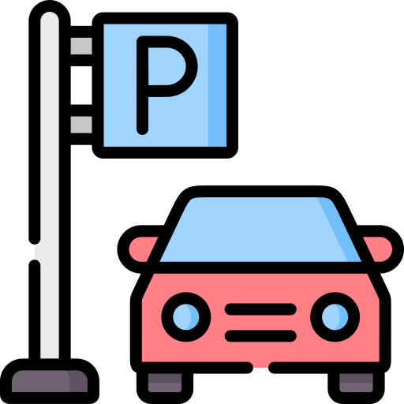

# LINEEE -- Improve the Experience in the Community

## **Request:**
* Login/Register, User UI

* MyAccount (Amount Due, Community Credit, Personal Information (unchangeable once registered), Address)
* Check for the fee of electricity & water (daily update, or weekly, but count up monthly)
* Amount Due = Rent + Fee + Cart (if purchased)

     

## **Community Interaction:**
* Post from neighbors (verification of content is needed, likes only)
* Community Activities/Announcements (Main Info)
* Stores around the community (info: pic., business hour, address, category, star products)
* Parking System (Check for open spot, live update)
* Complaint Box (Image with text)
* Pull a Request (Interacting with property, housekeeping service (if needed))
* Community Mall (fee will be charged to your amount if purchased, credits = discounts)

     

## **Ways of Increasing credit:**
* Likes from posts
* Credit Bonus from stared posts, effective complaints, on-time payments
* Help update any information in the community

    